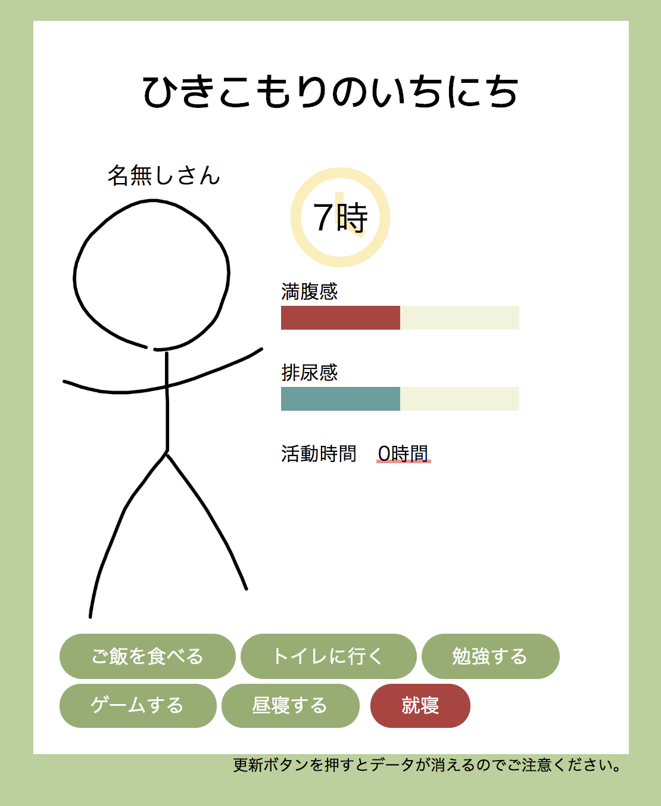

# ひきこもりのいちにち

本番ページはこちらです。
「[ひきこもりのいちにち](https://aiandrox.github.io/hikikomori_oneday/)」

### 操作法

名前と起床時刻を記入したら、「起床ボタン」をクリックするだけ。
あとは、思うままに家でごろごろしよう。
１日を終えた後には、過ごし方についてのコメントもあるよ。

もしかしたら、１日を完遂させられないこともあるかもしれない。人間なので……。

## 使用技術

- Vue.jp(CDN版)

## 追加したいこと

- 次の日になった時に表示が崩れる
- データベースを使ってランキング機能
- ステータスを追加
- 行動を追加